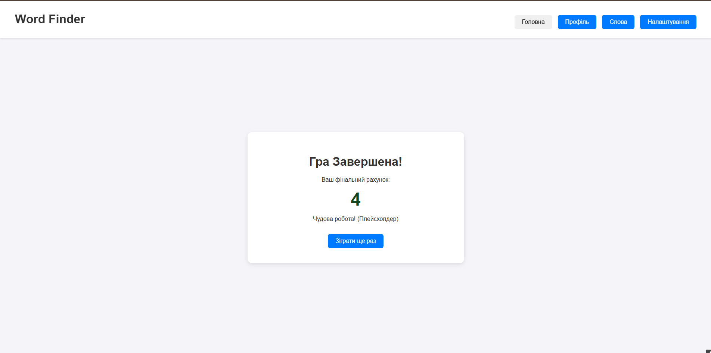
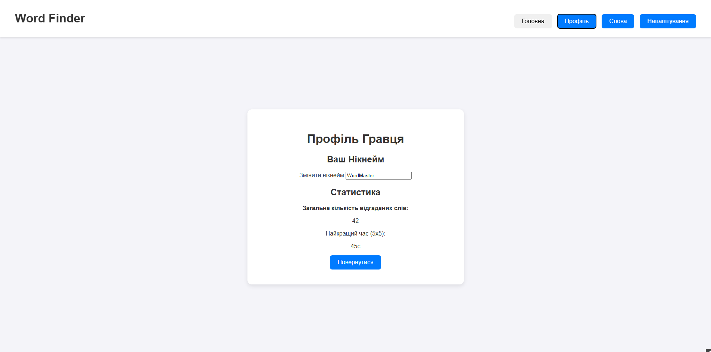
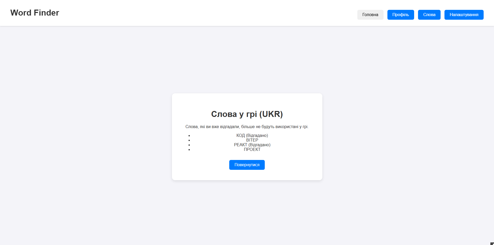
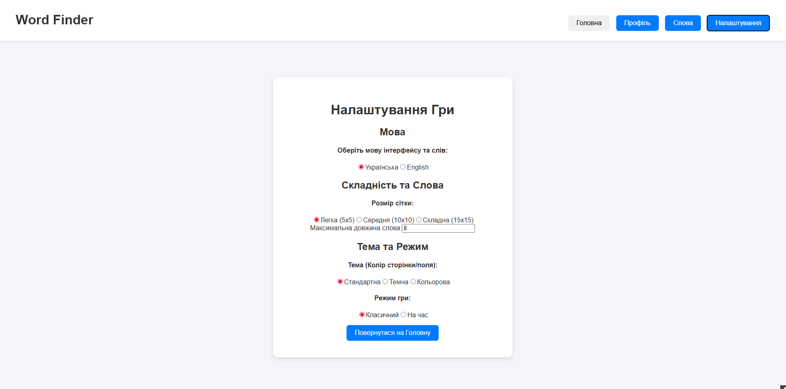

## 📁 Структура Проекту

* **`src/pages/`**: Містить основні компоненти, які виступають у ролі "сторінок" (Start, Game, Settings, Profile, Words).
##Головна сторінка 

##Сторінка гри

##Сторінка результатів

##Сторінка профіля користувача

##Сторінка всіх слів існуючих в грі

##Сторінка налаштувань

